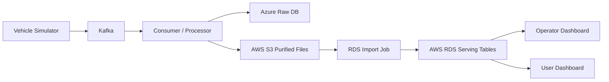

# Architecture

## Summary

The project collects and refines vehicle data in a multi-cloud environment, then serves dashboard workloads from AWS.

- Upstream data processing zone: Azure-based collection and processing area
- Service delivery zone: AWS VPC-based dashboard and serving area
- Query principle: dashboards read RDS serving tables, not S3 directly
- Refresh model: near-real-time micro-batch updates every 1 to 5 minutes

## Current Target Architecture

## AWS Public Cloud Scope

- External entry point is `ALB`
- Target direction is `WAF -> ALB`, but WAF is deferred in Phase 1
- Service workloads run in `Private App Subnets`
- RDS runs in `Private DB Subnets`
- S3 access uses a `Gateway VPC Endpoint`
- Operational access uses `SSM Session Manager`, not a bastion host
- K3s baseline uses shared `Private App` subnets across two AZs, with control-plane and worker roles separated by node placement plus labels and taints
- NAT Gateway count is fixed at `1` for the current cost-sensitive baseline

## Phase 1 AWS Placement

- `Public-A`: ALB, NAT Gateway
- `Public-C`: ALB
- `Private-App-A`: shared application subnet in AZ-A for K3s control-plane and worker node groups
- `Private-App-C`: shared application subnet in AZ-C for K3s control-plane and worker node groups
- `Private-DB-A/C`: DB subnet group for a single RDS instance
- `S3 Gateway Endpoint`: attached to private route tables
- `RDS`: one instance, with two DB subnets prepared
- `Operations`: SSM Session Manager through instance IAM role and outbound connectivity
- `Workload separation`: handled in the cluster layer with node labels and taints rather than separate operator/user subnets

## AWS Network Baseline

- Region: `ap-northeast-2`
- AZ count: `2`
- Subnet layout:
  - Public x 2
  - Private App x 2
  - Private DB x 2
- Routing baseline:
  - Public -> IGW
  - Private App -> NAT Gateway
  - Private DB -> local only

## Ownership Boundary

- Infra 1: VPC, Subnet, Route, NAT, S3 Endpoint, SG, ALB
- Infra 2: EC2, Launch Template, ASG, K3s, Linkerd, Ansible, SSM-ready instance role
- Infra 3: S3, RDS, DB Subnet Group, import flow
- Infra 4: Dashboard deployment, GitHub Actions, service health check

## Open Items

- Detailed Azure-side resource design and connectivity
- WAF timing and rule definition
- Final RDS import file format
- ALB listener, target group, and ingress details
- Whether to add private VPC endpoints for `ssm`, `ssmmessages`, and `ec2messages` in a later phase
